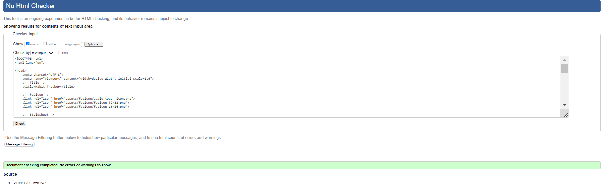
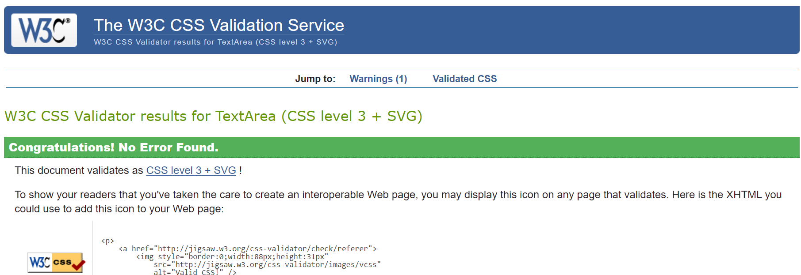
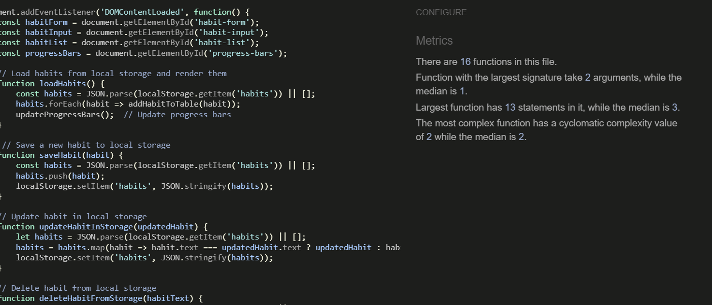
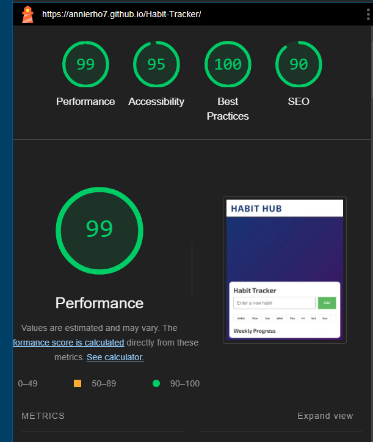
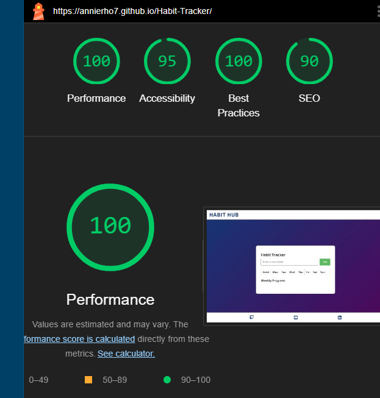

# Habit Tracker

The Habit Tracker site is designed to help users track their daily habits and monitor their progress over time. Users can add new habits, delete them, mark them as completed or incomplete, and view their weekly progress.

Visit the deployed site: [Habit Hub](https://annierho7.github.io/Habit-Tracker/)

## Picture of the website in different devices
  

## User Experience (UX)

### User Stories

* As a user, I want to easily add and manage my daily habits.
* As a user, I want to see my progress visually, both daily and weekly.
* As a user, I want to be able to delete habits that I no longer need to track.

- - -

### Testing user stories
**User Story 1**: As a user, I want to easily add new habits to track my daily routines.
- Feature: Input field to add new habits.
- Feature: Submit button to add the habit to the tracker.

**User Story 2**: As a user, I want to mark habits as completed when I finish them each day.
- Feature: Toggle functionality to mark habits as completed or incomplete.
- Feature: Visual indication (a tick) when a habit is marked as completed.

**User Story 3**: As a user, I want to view my daily progress at a glance.
- Feature: Table layout displaying habits on the left and days of the week (Monday to Sunday) across the top.
- eature: Clickable boxes to mark habits as completed for each day.

**User Story 4**: As a user, I want to delete habits that I no longer wish to track.
- Feature: Delete button next to each habit to remove it from the tracker.

**User Story 5**: As a user, I want to view my weekly progress visually.
-  Weekly progress bar showing completion indicator for each habit.

## Bugs
I ran my code through validator and learned that I had a space character in one of my folders which was an error i fixed.
After changing some CSS my footer was showing list style type so i set that to none.
Weekly progress bars were off so I  went and checked css to see I had forgot to remove previous CSS.
My habit tracker was not responive on all screen sizes. I added a media query to fix this.

### Features

Habit Tracker is a single-page application featuring sections for adding habits, marking them as completed, deleting habits, and displaying weekly progress.

## Picture of the Habit Section

In the Habit section, you can enter new habits, mark them as completed or incomplete, and delete them.

## Picture of the Weekly Progress Section

The Weekly Progress section visually represents your habits' completion status over the course of 7 days.

- - -

### Accessibility

I have ensured that Habit Tracker is accessible-friendly by:

* Using semantic HTML.
* Maintaining sufficient color contrast throughout the site.
* Conducting accessibility testing using tools like Lighthouse.

### Future Implementations

* Introduce streak tracking for consecutive days of completing habits.
* Add reminders and notifications for habit completion.
* Add monthly logs for users to view and analyze their habit completion data monthly.

- - -

## Technologies Used

### Languages Used

HTML, CSS, JavaScript

### Frameworks, Libraries & Programs Used

- [GitHub](https://github.com/) - Repository hosting and version control.
- [GitPod](https://www.gitpod.io/) - Integrated Development Environment (IDE).
- [Google Fonts](https://fonts.google.com/) - Importing fonts used on the website.
- [Font Awesome](https://fontawesome.com/) - Icons for UI elements.
- [Google Developer Tools](https://developer.chrome.com/docs/devtools/) - Testing and troubleshooting.
- [Am I Responsive?](http://ami.responsivedesign.is/) - Responsive design visualization tool.
- [Balsamic](https://balsamiq.com/wireframes/?gclid=Cj0KCQiA14WdBhD8ARIsANao07g6CkndNmxQPlHP92mM3VQBwb6lbQIg5FPinhmNFxWsAnM7BpA_PukaAldMEALw_wcB)
 Balsamiq is used to create and design wireframes.

- - -

## Deployment
- Github pages
    - This project was deployed to GitHub Pages using the following steps
      - Log in to GitHub and locate the GitHub Repository
      - At the top of the Repository (not top of page), locate the "Settings" Button on 
        the menu.
      - Scroll down the Settings page until you locate the "GitHub Pages" Section.
      - Under "Source", click the dropdown called "None" and select "Master Branch".
      - The page will automatically refresh.
      - Scroll back down through the page to locate the now published site link in the "GitHub Pages" section.
      - live link for the page can be found here [Aligned](https://annierho7.github.io/aligned/index.html)
- Forking the GitHub Repository
    - By forking the GitHub Repository we make a copy of the original repository on our GitHub account to view and/or make changes without affecting the original repository by using the following steps
     - Log in to GitHub and locate the GitHub Repository
     - At the top of the Repository (not top of page) just above the "Settings" Button on the menu, locate the "Fork" Button.
     - You should now have a copy of the original repository in your GitHub account.
- Making a Local Clone
   - Log in to GitHub and locate the GitHub Repository
   - Under the repository name, click "Clone or download".
   -  To clone the repository using HTTPS, under "Clone with HTTPS", copy the link.
   - Open Git Bash
   - Change the current working directory to the location where you want the cloned directory to be made
   - Type git clone, and then paste the URL you copied in Step 3.
      - $ git clone https://github.com/YOUR-USERNAME/YOUR-REPOSITORY
   - Press Enter. Your local clone will be created.

- - -

## Testing

Testing was conducted throughout the development process using Chrome Developer Tools for debugging and troubleshooting.

Both HTML and CSS were validated using W3C validators, Javascript was tested using JSHINT ensuring compliance and correctness.

### Lighthouse

Lighthouse was used to test performance, accessibility, best practices, and SEO of the website.

### Browser Compatibility
Tested the website on different browsers to ensure compatibility:
- Google Chrome
- Mozilla Firefox
- Microsoft Edge
- Safari

### Responsiveness
Screenshots of responsivness on different browsers.
[Microsoft](/assets/readme-images/EdgeSS.png)
[Firefox](/assets/readme-images/firefoxSS.png)
[Google](/assets/readme-images/chromeSS.png)
[Safari](/assets/readme-images/safariscreenshot.jpg)

- - -

## Credits

* Code Institute for foundational knowledge and project inspiration. [Code Institute](https://codeinstitute.net/)
* GitHub for version control and repository hosting. [GitHub](https://github.com/)
* GitPod for providing an excellent IDE for coding. [GitPod](https://www.gitpod.io/)
* Google Fonts for providing fonts used in the project. [Google Fonts](https://fonts.google.com/)
* Stack Overflow for valuable insights and problem-solving assistance. [Stack Overflow](https://stackoverflow.com/)
* ChatGPT for helping me breakdown and understand javascript. [ChatGPT](https://chatgpt.com/)
* Perplexity for helping me breakdown and understand javascript. [Perplexity](https://www.perplexity.ai/)
* W3Schools for helping me write my HTML, CSS and Javascript. [W3Schools](https://www.w3schools.com/)
* Font Awesome for my icons. [Font Awesome](https://fontawesome.com/)

- - -

## Acknowledgments

Thanks to my class mates, my tutor for taking time to explain things to me and various online tutorials for guidance and inspiration.